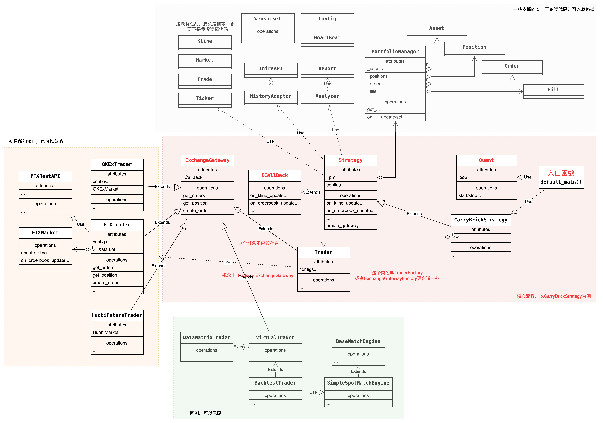

# python工程结构
## 一个比较标准的python工程 alphahunter
### 代码库
https://github.com/phonegapX/alphahunter/tree/master 

### 架构
作者说代码是用面向对象和面向接口编程思想写的。其实就是从业务流程中抽象： 有哪些实体，每个实体做什么。然后转成类就行。
* 策略基础类 Strategy
* 交易所网关回调接口类ExchangeGateway.ICallBack 
* 所有量化策略都需要继承自 Strategy基类并且实现 ExchangeGateway.ICallBack接口 
* Strategy自带了一个数据管理器 PortfolioManager用于统一缓存并管理相应策略的仓位,订单,资产,成交等信息。
* Strategy.create_gateway创建指定的交易所网关与交易所建立连接进行交易
* Trader类,统一对各交易所进行创建和管理

### 怎么读代码
从主函数入手。如果代码是很多个服务的集合的话，从每个服务入手。
不管主函数还是服务，都是在讲这个程序在干什么。
读代码主要是梳理出代码中有哪些实体，这些实体都有什么动作，实体是怎么关联在一起形成业务流程的。最终会画出来两个图：实体图UML，时序图。
实体图用来描述实体和关系。
时序图用来描述业务流程。
好的代码是抽象之后的业务流程，一开始不好读，但是好的抽象能抓住业务的本质。

### 实体图
看着比较复杂，抓住主流程，忽略边边角角的实体就行。

### 时序图
这个我是第一次画，画得比较简单。回调那部分偷懒了。

## 一个非常不标准的python工程，quant

### 代码库 
https://github.com/teancake/quant 

### 架构
* 这个工程没有做任何架构设计。它的每个python文件基本都是独立的，有各自的入口。
* 这样做的原因是，有一个任务调度系统会执行很多任务，每个任务会对应一个python文件。

## python工程模板

